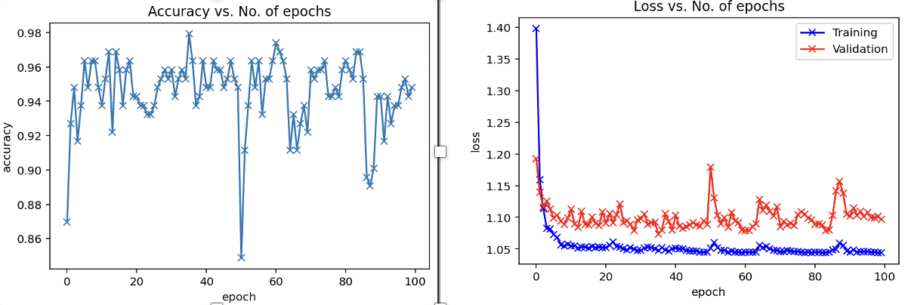

# AI Waste Sorter
**Final Individual Project for Duke AIPI 540: Deep Learning Applications**

<p align="left"> 

## Motivation

<p align="left"> 

By following the three R's - Reduce, Reuse, Recycle, you are helping to 
create a more sustainable future for our planet and future generations. 
According to Forbes: 
- 94% of Americans support recycling
- 74% say it should be a top priority 
- However, only 35% of people actually recycle

This low statistic might be caused by the lack of awareness on what can be 
actually recycled. Educating recyclable materials can help waste management 
systems become more efficient. Therefore, a need for automation in this 
process can help people understand the different classes in waste 
management systems. This application will use computer vision to 
identify the six different classes: glass, paper, cardboard, plastic, metal,
and trash.
<p align="left"> 

## Getting Started
1. Create virtual environment `python3 -m venv environment_name`
2. Activate virtual environment `source environment_name/bin/activate`
3. Install Requirements `pip install -r requirements.txt`
4. Run Flask app locally 
   1. `python3 app.py` 
   2. `python3 app.py --server.port=8080 --server.address=127.0.0.1`
5. Run app locally with Docker 
   1. `docker build . -t app.py` 
   2. `docker run -p 8080:8080 app.py`
6. Run app from GCP `gcloud app browse`


## Shortcuts (Makefile)
1. To run the app locally `make run`
2. To build & locally run with Docker`make run-container`
3. To deploy the app on GCP`make gcloud-deploy`

## Data Sourcing & Processing
This can be found in the [data](data/README.md) folder with a `README.md` 
file explaining data acquisition and pre-processing.

## Modeling Details
A comparsion was made between a regular CNN neural network built from 
scratch and a pre-trained ResNet-50 CNN for separating waste into six 
classes. The transfer learning method from the pre-trained ResNet-50 proved 
to perform better significantly. 

ResNet-50 is a convolutional neural network that is 50 layers deep. You can 
load a pretrained version of the network trained on more than a million 
images from the ImageNet database. The pretrained network can classify 
images into 1000 object categories, such as keyboard, mouse, pencil, and 
many animals. 

As a result, the network has learned rich feature representations for a 
wide range of images. Once the model was trained, it was exported along its 
weights as a pth file`pre-trained_CNN.pth` to use in web app deployed on 
flask/gcloud.

### Modeling Evaluation
The metrics used to evaluate the model were accuracy & cross-entropy loss.

- Neural Network (CNN)

<p align="left"> <p>

- ResNet-50

<p align="left"> <p>

## Results & Room for Improvement
In the dataset all of the pictures were taken behind a white poster board 
background making it hard to detect objects behind multicolor backgrounds. 
Here are the results of the model tested on external googled images:
 - White poster board background
<p align="left"> <p>
 - Multicolor background
<p align="left"> <p>

## Deployment Architecture
<p align="left"> <p>

## Project Structure
The project data and codes are arranged in the following manner:
```python3 tree -L 2
├── Dockerfile
├── Makefile
├── README.md
├── app.py
├── app.yaml
├── data
│   └── README.md
├── img
│   ├── Build-Architect.png
│   ├── model1_metrics.png
│   ├── model2_metrics.png
│   ├── result_fail.png
│   ├── result_pass.png
│   ├── waste-sorter.jpg
│   └── waste_app_UI.png
├── models
│   └── pre-trained_CNN.pth
├── notebooks
│   └── Waste_Classification_with_Pytorch.ipynb
├── requirements.txt
├── scripts
│   ├── __pycache__
│   ├── index_to_class_label.json
│   ├── resnet_model.py
│   └── trained_resnet.py
├── static
│   ├── index.js
│   └── style.css
├── templates
│   ├── base.html
│   ├── index.html
│   └── inference.html
└── venv
    ├── bin
    ├── etc
    ├── lib
    ├── pyvenv.cfg
    └── share

```
## Acknowledgements
* [Deep Learning](https://github.com/AIPI540/AIPI540-Deep-Learning-Applications) - Professor Jon 
  Reifschneider 
* [Pytorch](https://pytorch.org/) - The Machine Learning framework used
* [Flask](http://flask.palletsprojects.com/en/1.1.x/) - The web server library
* [Pytorch-Flask-Starter](https://github.com/imadtoubal/Pytorch-Flask-Starter)
* [trashnet](https://github.com/garythung/trashnet) - Gary Thung
